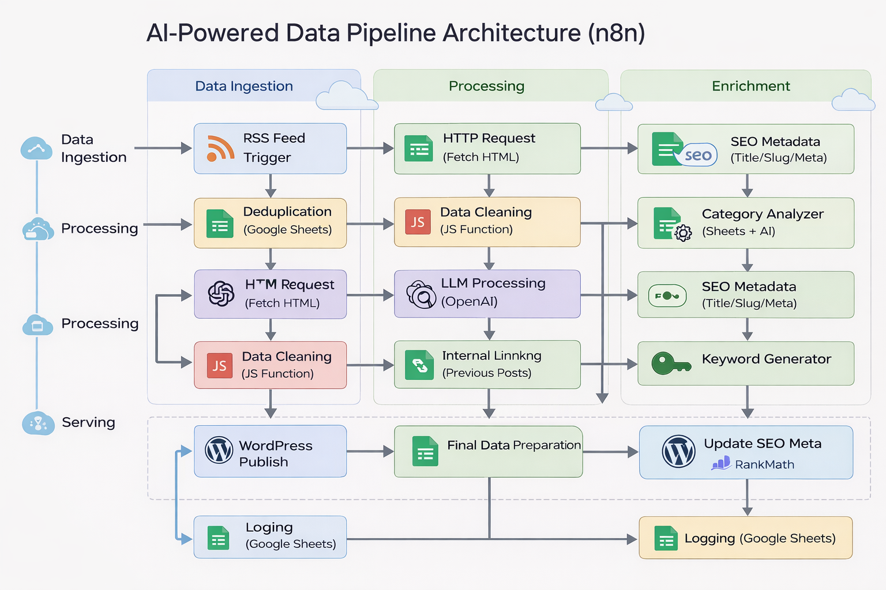
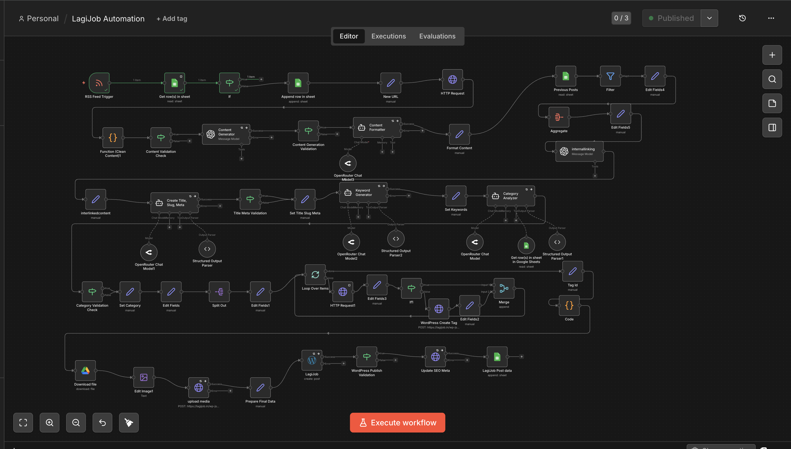

# 🚀 AI-Powered Job Content Data Pipeline (n8n + LLM + WordPress)

> End-to-end automated **data engineering pipeline** that ingests job data, transforms unstructured HTML using AI, enriches it with SEO metadata, and publishes directly to WordPress.

---

## 📌 Overview

This project demonstrates a **production-grade data pipeline** built using **n8n**, integrating **LLMs (OpenAI + Google Gemini)** and **WordPress APIs**.

The pipeline automates:

- RSS-based data ingestion  
- HTML data cleaning & transformation  
- AI-powered content generation  
- SEO enrichment (title, slug, keywords)  
- Dynamic tag & category creation  
- Automated WordPress publishing  
- Logging & monitoring  

---

## 🧠 Why This Project Matters

Most portfolios show:
- ❌ Static datasets  
- ❌ Basic ETL scripts  

This project shows:

- ✅ Event-driven architecture  
- ✅ Real-world API integrations  
- ✅ AI-powered transformation  
- ✅ Production-style pipeline design  
- ✅ Automation at scale  

---

## 🏗️ Architecture Diagram

---

## 🔄 Actual n8n Workflow

---

## 🔄 End-to-End Data Flow
RSS Feed → Deduplication → HTTP Fetch → Data Cleaning → AI Processing →
Formatting → SEO Enrichment → Category Mapping → Tag Creation →
WordPress Publishing → SEO Update → Logging

---

## ⚙️ Pipeline Breakdown

### 🔹 1. Data Ingestion
- RSS Feed Trigger (every 10 minutes)

---

### 🔹 2. Deduplication
- Google Sheets lookup
- Prevents duplicate processing

---

### 🔹 3. Data Extraction
- HTTP Request fetches raw HTML

---

### 🔹 4. Data Cleaning

Custom JavaScript:
- Removes scripts, ads, unwanted elements  
- Removes WhatsApp/Telegram/social content  
- Extracts main content using regex  

---

### 🔹 5. AI Transformation

Using OpenAI:
- Converts raw HTML → structured markdown  
- Generates job details, tables, structured info  

---

### 🔹 6. Content Formatting

LLM Agent:
- Converts markdown → WordPress HTML  
- Applies SEO-friendly structure  

---

### 🔹 7. SEO Metadata Generation

Automatically generates:
- Title  
- Slug  
- Meta description  

---

### 🔹 8. Keyword Engine

- Generates 3–5 SEO keywords  
- Stores both array & string format  

---

### 🔹 9. Category Mapping

- Uses Google Sheets reference  
- AI-based semantic matching  

---

### 🔹 10. Tag Processing

- Splits keywords into tags  
- Checks existing tags via API  
- Creates new tags if required  

---

### 🔹 11. Publishing Layer

WordPress API:
- Create post  
- Assign categories & tags  
- Upload content + featured image  

---

### 🔹 12. SEO Update

- Updates RankMath metadata  

---

### 🔹 13. Logging

Google Sheets stores:
- Title  
- Keywords  
- Category IDs  
- Tag IDs  
- Post ID  
- Status  

---

## 🛠️ Tech Stack

| Category        | Tools |
|----------------|------|
| Orchestration  | n8n |
| Data Source    | RSS Feed |
| Processing     | JavaScript |
| AI Models      | OpenAI, Google Gemini |
| Storage        | Google Sheets |
| API Layer      | WordPress REST API |
| SEO            | RankMath |

---

## 🧩 Key Features

- ⚡ Fully automated pipeline  
- 🧠 AI-powered transformation  
- 🔍 SEO automation  
- 🔄 Dynamic tag & category creation  
- 🧪 Validation & error handling  
- 📊 Logging & tracking  

---

## 📊 Data Engineering Concepts Applied

- ETL Pipeline Design  
- Event-driven Architecture  
- Data Cleaning & Transformation  
- API Integration  
- Data Enrichment  
- Idempotency Handling  
- Micro-batch Processing  

---

## 🚧 Challenges & Solutions

| Challenge | Solution |
|----------|--------|
| Duplicate data | Google Sheets lookup |
| Noisy HTML | Custom JS cleaning |
| Unstructured data | LLM transformation |
| SEO automation | AI-generated metadata |
| Tag duplication | API validation |
| API failures | Retry + validation logic |

---

## 🔐 Security & Best Practices

- Credentials secured in n8n  
- API keys not exposed  
- Workflow JSON sanitized  
- Sensitive data masked  

---
---

## 🚀 How to Run

1. Import workflow into n8n  
2. Configure:
   - OpenAI API  
   - Google Sheets  
   - WordPress API  
3. Activate workflow  
4. Monitor execution  

---

## 📈 Future Improvements

- Replace Google Sheets → Data Warehouse  
- Add Airflow for orchestration  
- Introduce Kafka streaming  
- Add monitoring dashboards  
- Implement data quality checks  

---

## 👨‍💻 Author

**Vicky Singh**  
Data Engineer | Automation & AI Enthusiast 🚀  

---

## ⭐ Support

If you found this useful:

- ⭐ Star the repo  
- 🍴 Fork it  
- 📢 Share it  

---

⚠️ Note: Full n8n workflow JSON is not publicly shared to protect proprietary logic and prompts.  
A high-level workflow explanation is provided instead.
